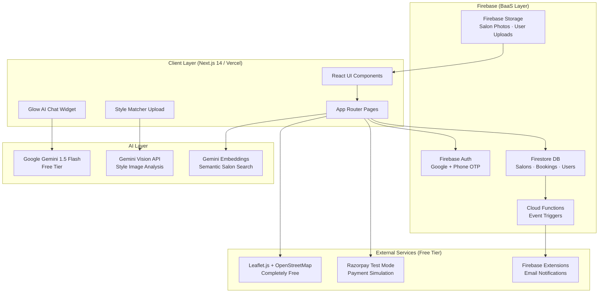
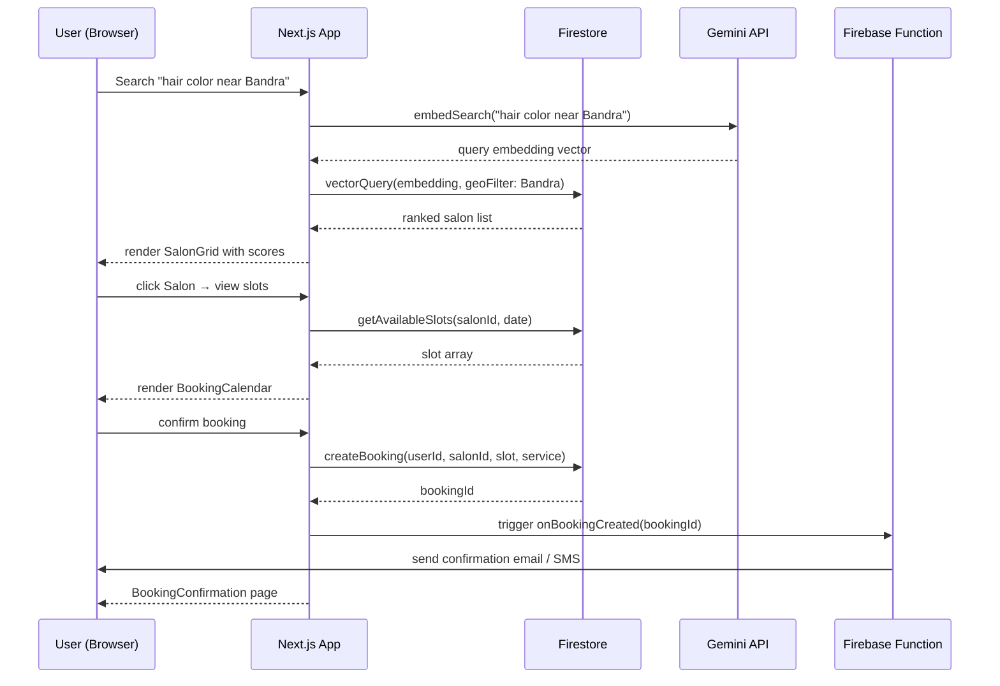
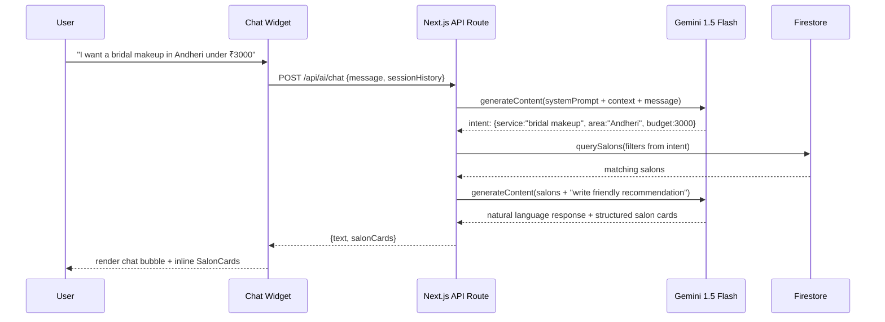

# Design Document: Beauty Salon Marketplace

> **Platform**: GlowCity — Mumbai's AI-Powered Beauty Salon Marketplace  
> **Hackathon**: SuperXgen AI Startup Buildathon 2026 (48-hour build)  
> **Stack**: Next.js 14 · TypeScript · Firebase · Google Gemini API · Tailwind CSS · Vercel

---

## Overview

GlowCity is a city-focused, AI-enhanced beauty salon discovery and booking platform targeting Mumbai's fragmented salon market. Customers can discover salons by location, service type, and budget; get AI-powered style recommendations; and book appointments in under 60 seconds. Salon owners get a lightweight dashboard to manage bookings, showcase their work, and receive AI-generated promotional copy.

The platform differentiates itself through three AI pillars: a conversational booking assistant ("Glow AI") that understands natural-language requests, an image-based style matcher that recommends salons based on uploaded inspiration photos, and a smart slot optimizer that fills last-minute cancellations. These features directly target the hackathon's AI Usage & Innovation judging criterion while delivering genuine user value.

The entire stack runs on free-tier services (Firebase, Vercel, Gemini API), making it deployable end-to-end within the 48-hour window without any credit card requirement.

---

## Architecture

### High-Level System Architecture



### Request Flow — Booking a Slot



### AI Chat — Glow AI Booking Assistant



---

## Components and Interfaces

### Component Hierarchy

```
app/
├── (public)/
│   ├── page.tsx                  # Landing / Hero
│   ├── salons/
│   │   ├── page.tsx              # Salon Discovery (search + map)
│   │   └── [salonId]/
│   │       ├── page.tsx          # Salon Detail
│   │       └── book/page.tsx     # Booking Flow
│   ├── style-match/page.tsx      # AI Style Matcher
│   └── ai-assistant/page.tsx     # Glow AI Chat
├── (auth)/
│   ├── login/page.tsx
│   └── register/page.tsx
├── dashboard/
│   ├── (customer)/
│   │   ├── bookings/page.tsx
│   │   └── profile/page.tsx
│   └── (salon-owner)/
│       ├── overview/page.tsx
│       ├── slots/page.tsx
│       └── ai-copy/page.tsx      # AI-generated promo copy
└── api/
    ├── ai/chat/route.ts          # Glow AI endpoint
    ├── ai/style-match/route.ts   # Vision-based matcher
    ├── ai/embed-search/route.ts  # Semantic search
    └── payments/create-order/route.ts
```

### Core TypeScript Interfaces

```typescript
// ── Domain Models ────────────────────────────────────────────────

interface Salon {
  id: string
  name: string
  slug: string
  city: string
  area: string                        // e.g. "Bandra West"
  coordinates: GeoPoint               // Firestore GeoPoint
  coverImage: string                  // Storage URL
  gallery: string[]
  services: Service[]
  priceRange: PriceRange              // 'budget' | 'mid' | 'luxury'
  rating: number                      // 0–5, computed from reviews
  reviewCount: number
  tags: string[]                      // ["bridal", "hair-color", "keratin"]
  embedding?: number[]                // Gemini embedding for semantic search
  isVerified: boolean
  ownerId: string
  openingHours: WeeklyHours
  createdAt: Timestamp
}

interface Service {
  id: string
  name: string
  category: ServiceCategory           // 'hair' | 'skin' | 'nails' | 'bridal' | 'grooming'
  duration: number                    // minutes
  price: number                       // INR
  description: string
}

interface Booking {
  id: string
  userId: string
  salonId: string
  serviceIds: string[]
  slot: TimeSlot
  status: BookingStatus               // 'pending' | 'confirmed' | 'completed' | 'cancelled'
  totalAmount: number
  paymentStatus: PaymentStatus        // 'unpaid' | 'paid' | 'refunded'
  paymentOrderId?: string             // Razorpay order ID
  aiRecommended: boolean              // flagged if booked via Glow AI
  createdAt: Timestamp
}

interface TimeSlot {
  date: string                        // ISO date "2026-01-15"
  startTime: string                   // "10:00"
  endTime: string                     // "11:30"
  isAvailable: boolean
}

interface User {
  uid: string
  displayName: string
  email: string
  phone?: string
  photoURL?: string
  role: UserRole                      // 'customer' | 'salon_owner' | 'admin'
  favoritesSalonIds: string[]
  bookingHistory: string[]            // booking IDs
  stylePreferences?: StyleProfile
  createdAt: Timestamp
}

interface StyleProfile {
  inspirationImageUrls: string[]      // uploaded to Storage
  extractedTags: string[]             // Gemini Vision analysis: ["balayage", "soft waves"]
  lastUpdated: Timestamp
}

// ── AI Interfaces ─────────────────────────────────────────────────

interface ChatMessage {
  role: 'user' | 'assistant'
  content: string
  salonCards?: SalonCard[]            // structured data embedded in response
  timestamp: number
}

interface ChatSession {
  id: string
  userId?: string
  messages: ChatMessage[]
  extractedIntent?: BookingIntent
}

interface BookingIntent {
  service?: string
  area?: string
  budget?: number
  date?: string
  priceRange?: PriceRange
}

interface SalonCard {
  salonId: string
  name: string
  area: string
  rating: number
  priceRange: PriceRange
  matchScore: number                  // 0–1, AI relevance score
  coverImage: string
  relevantService: string
}

interface StyleMatchResult {
  extractedTags: string[]             // ["balayage", "curtain bangs", "warm tones"]
  recommendedSalons: SalonCard[]
  confidenceScore: number
  description: string                 // "You're going for a sun-kissed boho look…"
}

// ── Supporting Types ──────────────────────────────────────────────

type ServiceCategory = 'hair' | 'skin' | 'nails' | 'bridal' | 'grooming' | 'spa'
type PriceRange = 'budget' | 'mid' | 'luxury'
type BookingStatus = 'pending' | 'confirmed' | 'completed' | 'cancelled'
type PaymentStatus = 'unpaid' | 'paid' | 'refunded'
type UserRole = 'customer' | 'salon_owner' | 'admin'

interface WeeklyHours {
  [day: string]: { open: string; close: string; closed: boolean }
}

interface GeoPoint {
  latitude: number
  longitude: number
}

interface PaginatedResult<T> {
  items: T[]
  total: number
  hasMore: boolean
  lastVisible?: unknown               // Firestore document snapshot cursor
}
```

---

## Data Models

### Firestore Collection Schema

```
firestore/
├── salons/{salonId}                  # Salon documents
│   ├── services (subcollection)      # Service documents
│   └── reviews (subcollection)       # Review documents
├── users/{uid}                       # User profiles
├── bookings/{bookingId}              # All bookings
├── slots/{salonId_date}              # Pre-computed slot availability
│   └── slots (subcollection)         # Individual TimeSlot documents
└── chatSessions/{sessionId}          # AI chat history
```

**Salon Document (indexed fields)**:
- `city` (equality filter)
- `area` (equality filter)
- `priceRange` (equality + array-contains)
- `tags` (array-contains-any)
- `rating` (range + orderBy)
- `coordinates` (geospatial — via geohash string `geohash`)

**Booking Document (indexed fields)**:
- `userId` + `status` (composite)
- `salonId` + `slot.date` (composite)

### Database Schema Details

```typescript
// Firestore document shapes (matching Firestore rules)

// /salons/{salonId}
type SalonDoc = Omit<Salon, 'services'> & {
  geohash: string          // geohash-js encoded from coordinates for geo queries
  serviceCount: number     // denormalized count
  updatedAt: Timestamp
}

// /salons/{salonId}/services/{serviceId}
type ServiceDoc = Service & {
  salonId: string
  isActive: boolean
}

// /bookings/{bookingId}
type BookingDoc = Booking & {
  salonName: string        // denormalized for dashboard queries
  serviceName: string      // denormalized for display
  userEmail: string        // denormalized for notifications
}

// /slots/{salonId_YYYY-MM-DD}/slots/{HH:mm}
type SlotDoc = TimeSlot & {
  salonId: string
  bookedByUserId?: string
  bookingId?: string
  lockedUntil?: Timestamp  // optimistic lock during checkout
}
```

---

## Key Functions with Formal Specifications

### 1. `searchSalons()` — Semantic + Geo Search

```typescript
async function searchSalons(
  query: string,
  filters: SearchFilters,
  pagination: PaginationParams
): Promise<PaginatedResult<Salon>>
```

**Preconditions:**
- `query` is a non-empty string (max 200 chars)
- `filters.city` is a valid city string if provided
- `pagination.limit` is between 1 and 50

**Postconditions:**
- Returns salons sorted by relevance score (AI embedding cosine similarity × rating weight)
- `result.items` contains only salons where `isVerified === true`
- If `filters.area` is provided, all results are within that area
- `result.hasMore` accurately reflects remaining documents

**Loop Invariants:**
- During embedding-based ranking: all previously scored salons retain their scores unchanged

---

### 2. `createBooking()` — Atomic Slot Reservation

```typescript
async function createBooking(
  userId: string,
  salonId: string,
  serviceIds: string[],
  slot: TimeSlot
): Promise<{ bookingId: string; paymentOrderId: string }>
```

**Preconditions:**
- `userId` is authenticated (verified Firebase UID)
- `slot.isAvailable === true` at time of call
- `serviceIds` is non-empty, all IDs exist under `salonId`
- `slot.date` is today or in the future

**Postconditions:**
- Slot document updated: `isAvailable = false`, `lockedUntil = now + 10min`
- Booking document created with `status = 'pending'`
- Razorpay order created and `paymentOrderId` returned
- If any step fails, Firestore transaction rolls back entirely (atomicity)
- Exactly one booking exists per `(salonId, slot)` combination

**Loop Invariants:** N/A (single atomic transaction)

---

### 3. `glowAIChat()` — AI Booking Assistant

```typescript
async function glowAIChat(
  message: string,
  sessionHistory: ChatMessage[],
  userId?: string
): Promise<{ reply: string; salonCards: SalonCard[]; intent: BookingIntent }>
```

**Preconditions:**
- `message` is non-empty (max 1000 chars)
- `sessionHistory` contains at most 20 prior messages (context window management)
- Gemini API key is configured in environment

**Postconditions:**
- `reply` is a non-empty, natural-language string
- `salonCards` contains 0–3 relevant salons (empty if no salon intent detected)
- `intent` captures extracted entities (may be partially populated)
- Session history is not mutated; function is pure w.r.t. input

**Loop Invariants:** N/A (no loops; single Gemini API round-trip)

---

### 4. `matchStyleFromImage()` — Vision-Based Style Matching

```typescript
async function matchStyleFromImage(
  imageUrl: string,
  userId?: string
): Promise<StyleMatchResult>
```

**Preconditions:**
- `imageUrl` points to a valid image in Firebase Storage (JPEG/PNG, max 5MB)
- Gemini Vision API is accessible

**Postconditions:**
- `result.extractedTags` is non-empty array of style descriptor strings
- `result.recommendedSalons` contains 1–5 salons ranked by tag overlap
- `result.confidenceScore` is in range [0, 1]
- If `userId` provided, tags are persisted to `/users/{userId}.stylePreferences`

**Loop Invariants:** N/A

---

### 5. `generateSlots()` — Slot Generation for a Day

```typescript
async function generateSlots(
  salonId: string,
  date: string,
  serviceDuration: number
): Promise<TimeSlot[]>
```

**Preconditions:**
- `date` is ISO format "YYYY-MM-DD" and not in the past
- `serviceDuration` is a positive integer (minutes)
- Salon document exists with valid `openingHours`

**Postconditions:**
- Returns array of non-overlapping `TimeSlot` objects
- Each slot has `duration >= serviceDuration`
- Slots already booked have `isAvailable = false`
- Slots are sorted chronologically

**Loop Invariants:**
- At each iteration: all generated slots so far are non-overlapping with each other

---

## Algorithmic Pseudocode

### Main Booking Flow Algorithm

```typescript
ALGORITHM: createBookingWithPayment(userId, salonId, serviceIds, slot)
INPUT: authenticated userId, salonId, serviceIds[], slot: TimeSlot
OUTPUT: { bookingId, paymentOrderId } or throws BookingError

BEGIN
  // Step 1: Validate inputs
  ASSERT userId is non-empty AND authenticated
  ASSERT serviceIds.length > 0
  ASSERT slot.date >= today()

  // Step 2: Compute total price
  services ← await fetchServices(salonId, serviceIds)
  ASSERT services.length === serviceIds.length  // all services exist
  totalAmount ← SUM(service.price FOR service IN services)

  // Step 3: Atomic slot lock + booking creation
  transaction ← firestore.runTransaction(async (txn) => {
    slotRef ← firestore.doc(`slots/${salonId}_${slot.date}/slots/${slot.startTime}`)
    slotDoc ← await txn.get(slotRef)

    IF slotDoc.data().isAvailable = false THEN
      THROW BookingError("SLOT_UNAVAILABLE")
    END IF

    bookingRef ← firestore.collection("bookings").doc()
    
    txn.update(slotRef, {
      isAvailable: false,
      lockedUntil: now() + 10 minutes,
      bookingId: bookingRef.id
    })
    
    txn.set(bookingRef, {
      userId, salonId, serviceIds, slot,
      status: "pending",
      totalAmount,
      paymentStatus: "unpaid",
      createdAt: serverTimestamp()
    })
    
    RETURN bookingRef.id
  })

  bookingId ← await transaction

  // Step 4: Create Razorpay order
  paymentOrderId ← await razorpay.orders.create({
    amount: totalAmount * 100,  // paise
    currency: "INR",
    receipt: bookingId
  })

  // Step 5: Update booking with payment order
  await firestore.doc(`bookings/${bookingId}`).update({ paymentOrderId })

  RETURN { bookingId, paymentOrderId }
END
```

### AI Chat Intent Extraction Algorithm

```typescript
ALGORITHM: glowAIChat(message, sessionHistory, userId?)
INPUT: message: string, sessionHistory: ChatMessage[], userId?: string
OUTPUT: { reply, salonCards, intent }

BEGIN
  // Step 1: Build Gemini prompt
  systemPrompt ← """
    You are Glow AI, a friendly beauty booking assistant for Mumbai salons.
    Extract booking intent as JSON: { service, area, budget, date, priceRange }
    Then respond conversationally. Always respond in the same language as the user.
  """

  conversationHistory ← sessionHistory.slice(-10)  // last 10 messages for context
  fullPrompt ← [systemPrompt, ...conversationHistory, { role: "user", content: message }]

  // Step 2: Call Gemini with structured output
  geminiResponse ← await gemini.generateContent({
    contents: fullPrompt,
    generationConfig: {
      responseMimeType: "application/json",
      responseSchema: ChatResponseSchema
    }
  })

  parsed ← JSON.parse(geminiResponse.text())
  intent ← parsed.intent    // { service?, area?, budget?, date?, priceRange? }
  naturalReply ← parsed.reply

  // Step 3: Query salons if intent detected
  salonCards ← []
  IF intent.service IS NOT EMPTY OR intent.area IS NOT EMPTY THEN
    salons ← await searchSalons(
      query: intent.service ?? "",
      filters: {
        city: "Mumbai",
        area: intent.area,
        priceRange: intent.priceRange,
        maxPrice: intent.budget
      },
      pagination: { limit: 3, offset: 0 }
    )
    salonCards ← salons.items.map(toSalonCard)
  END IF

  RETURN { reply: naturalReply, salonCards, intent }
END
```

### Style Matching Algorithm

```typescript
ALGORITHM: matchStyleFromImage(imageUrl, userId?)
INPUT: imageUrl: string (Firebase Storage URL), userId?: string
OUTPUT: StyleMatchResult

BEGIN
  // Step 1: Fetch image as base64 for Gemini Vision
  imageData ← await fetchImageAsBase64(imageUrl)
  
  // Step 2: Extract style tags via Gemini Vision
  visionPrompt ← """
    Analyze this hair/beauty inspiration image. 
    Return JSON: {
      tags: string[],           // max 8 specific style descriptors
      description: string,      // one friendly sentence describing the look
      confidence: number        // 0-1
    }
    Tag examples: "balayage", "curtain bangs", "warm tones", "soft waves", "ombre"
  """
  
  visionResult ← await gemini.generateContent({
    contents: [{ parts: [{ text: visionPrompt }, { inlineData: imageData }] }]
  })
  
  { tags, description, confidence } ← JSON.parse(visionResult.text())
  
  // Step 3: Find salons with matching expertise
  matchedSalons ← await firestore
    .collection("salons")
    .where("tags", "array-contains-any", tags.slice(0, 3))
    .where("city", "==", "Mumbai")
    .orderBy("rating", "desc")
    .limit(5)
    .get()
  
  // Step 4: Score and rank salons by tag overlap
  rankedSalons ← matchedSalons.docs
    .map(doc => {
      salon ← doc.data()
      overlap ← salon.tags.filter(t => tags.includes(t)).length
      matchScore ← overlap / tags.length
      RETURN { ...toSalonCard(salon), matchScore }
    })
    .sort((a, b) => b.matchScore - a.matchScore)
  
  // Step 5: Persist to user profile if authenticated
  IF userId IS NOT EMPTY THEN
    await firestore.doc(`users/${userId}`).update({
      "stylePreferences.extractedTags": tags,
      "stylePreferences.inspirationImageUrls": arrayUnion(imageUrl),
      "stylePreferences.lastUpdated": serverTimestamp()
    })
  END IF
  
  RETURN {
    extractedTags: tags,
    recommendedSalons: rankedSalons,
    confidenceScore: confidence,
    description
  }
END
```

---

## API Endpoint Structure

```typescript
// Next.js App Router API Routes

// POST /api/ai/chat
// Body: { message: string, sessionHistory: ChatMessage[], sessionId: string }
// Response: { reply: string, salonCards: SalonCard[], intent: BookingIntent }

// POST /api/ai/style-match
// Body: { imageUrl: string }
// Response: StyleMatchResult
// Auth: Optional (persists to profile if authenticated)

// POST /api/ai/embed-search
// Body: { query: string, filters: SearchFilters }
// Response: PaginatedResult<Salon>

// POST /api/payments/create-order
// Body: { bookingId: string, amount: number }
// Response: { orderId: string, currency: string, amount: number }
// Auth: Required

// POST /api/payments/verify
// Body: { orderId: string, paymentId: string, signature: string }
// Response: { success: boolean, bookingId: string }
// Auth: Required

// POST /api/ai/generate-promo-copy
// Body: { salonId: string, promotionType: 'instagram' | 'whatsapp' | 'website' }
// Response: { copy: string, hashtags: string[] }
// Auth: Required (salon owner only)
```

---

## Error Handling

### Error Scenario 1: Slot Race Condition

**Condition**: Two users attempt to book the same slot simultaneously  
**Response**: Firestore transaction detects `isAvailable = false`; throws `BookingError("SLOT_UNAVAILABLE")`  
**Recovery**: Client receives 409 status, prompts user to select an alternate slot; slot grid refreshes

### Error Scenario 2: Gemini API Rate Limit / Failure

**Condition**: Gemini API returns 429 or 500 during AI chat  
**Response**: API route catches error, returns fallback response with static salon list from Firestore  
**Recovery**: Chat widget shows "Having trouble thinking right now — here are some popular salons:" with non-AI results; no UX crash

### Error Scenario 3: Image Upload Too Large / Wrong Format

**Condition**: User uploads non-image file or image > 5MB to style matcher  
**Response**: Client-side validation rejects before upload; error toast shown  
**Recovery**: User prompted to compress image; FilePond component handles preview and validation

### Error Scenario 4: Payment Verification Failure

**Condition**: Razorpay signature verification fails  
**Response**: Booking status remains `pending`, payment status remains `unpaid`  
**Recovery**: Slot lock expires after 10 minutes, slot becomes available again; user shown retry option

### Error Scenario 5: Firebase Auth Token Expired

**Condition**: User's session token expires mid-flow  
**Response**: Firebase SDK automatically refreshes token; if refresh fails, redirect to `/login`  
**Recovery**: Booking flow state preserved in `sessionStorage`; restored after re-auth

---

## Testing Strategy

### Unit Testing Approach

Test business logic functions in isolation using **Vitest** (zero-config with Next.js):

- `generateSlots()` — verify non-overlapping, chronological, correct count for various `serviceDuration` values
- `toSalonCard()` — mapping function correctness
- `extractBookingIntent()` — JSON parsing and partial population
- Payment amount calculation — INR paise conversion
- Geohash encoding — verify same area → same geohash prefix

### Property-Based Testing Approach

**Property Test Library**: `fast-check` (npm package, works with Vitest)

```typescript
// Property: slot generation never produces overlapping slots
fc.assert(
  fc.property(
    fc.integer({ min: 15, max: 120 }),   // serviceDuration
    fc.string(),                          // date
    (duration, date) => {
      const slots = generateSlots(salonId, date, duration)
      for (let i = 0; i < slots.length - 1; i++) {
        assert(slots[i].endTime <= slots[i + 1].startTime)
      }
    }
  )
)

// Property: booking total equals sum of service prices
fc.assert(
  fc.property(
    fc.array(fc.record({ price: fc.integer({ min: 100, max: 10000 }) }), { minLength: 1 }),
    (services) => {
      const total = computeTotal(services)
      assert(total === services.reduce((sum, s) => sum + s.price, 0))
    }
  )
)
```

### Integration Testing Approach

Use **Firebase Local Emulator Suite** for end-to-end booking flow testing:
1. Seed emulator with test salon + slots
2. Simulate concurrent booking requests (race condition validation)
3. Verify Firestore security rules enforce auth constraints
4. Mock Gemini API responses for deterministic AI path testing

---

## Performance Considerations

- **Pagination**: All salon lists paginate at 12 items; Firestore cursors used (no `offset` queries)
- **Image Optimization**: Next.js `<Image>` with WebP conversion; salon gallery lazy-loaded
- **Embedding Caching**: Computed embeddings stored on `Salon.embedding`; not recomputed per search
- **Slot Pre-generation**: Slots generated nightly via Cloud Function for next 7 days; not computed on-demand
- **Chat Debounce**: AI chat requests debounced 500ms; streaming responses via Gemini streaming API for perceived speed
- **Static Generation**: Landing page and city/area pages statically generated at build time (ISR every 1 hour)

---

## Security Considerations

- **Firestore Rules**: Customers can only read/write their own bookings; salon owners can only write their own salon document
- **API Route Auth**: All mutation endpoints verify Firebase ID token via `admin.auth().verifyIdToken()`
- **Payment Security**: Razorpay webhook signature verified server-side using HMAC-SHA256 before updating booking status
- **Image Upload**: Firebase Storage rules restrict uploads to authenticated users; MIME type validated client + server
- **Gemini Prompt Injection**: System prompt always prepended; user input treated as data, not instruction; `max_output_tokens` capped
- **Rate Limiting**: Vercel Edge Middleware applies IP-based rate limiting on `/api/ai/*` routes (10 req/min per IP)
- **Environment Secrets**: All API keys in `.env.local` / Vercel environment variables; never exposed to client bundle

---

## Dependencies

| Package | Purpose | Tier |
|---|---|---|
| `next` 14 | Framework + App Router | Free |
| `firebase` / `firebase-admin` | Auth, Firestore, Storage | Free tier |
| `@google/generative-ai` | Gemini 1.5 Flash + Vision | Free tier |
| `leaflet` + `react-leaflet` | Maps (OpenStreetMap) | Free |
| `razorpay` | Payment processing (test mode) | Free test |
| `tailwindcss` + `shadcn/ui` | Styling + UI components | Free |
| `framer-motion` | Animations | Free |
| `react-hook-form` + `zod` | Forms + validation | Free |
| `fast-check` | Property-based testing | Free |
| `vitest` | Unit / integration tests | Free |
| `geohash-js` | Geospatial queries on Firestore | Free |
| `filepond` + `react-filepond` | Image upload UI | Free |
| `date-fns` | Date manipulation | Free |
| `zustand` | Client state management | Free |
